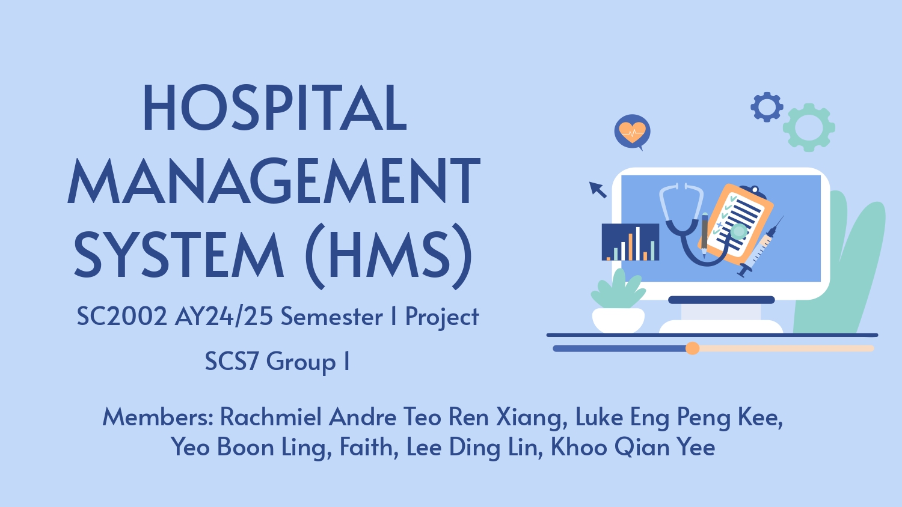

**Hospital Management System(HMS)** is a Java console application built using Object Oriented Principles. It allows for efficient access to hospital data by various stakeholders, such as doctors, pharmacists and patients. The system consists of various functions, such as management of hospital operations - patient management, staff management, appointment scheduling, and billing. The system is designed to be scalable as it closely follows the SOLID Principles.


## Links
- **[Main Page/Github Repository](https://github.com/rachtrx/HMS)**
- **[Documentation (JavaDoc)](https://hmsdocs.netlify.app/)**
- **[Report](https://github.com/rachtrx/HMS/blob/8d36714bdb96448ac46c1f0f92c1382731c80d1f/report/SCS7_1%20Report.pdf)**
- **[UML Class Diagram](https://github.com/rachtrx/HMS/blob/8d36714bdb96448ac46c1f0f92c1382731c80d1f/UMLClassDiagram/HMS.jpg)**
- **[All Test Cases](https://github.com/rachtrx/HMS/blob/1168e405297df90b49c501cf3f14195b2cca0608/completetestcases/FullListOfTestCases.pdf)**

## Team Members

| Name                          | GitHub Account                                       |
|-------------------------------|------------------------------------------------------|
| Rachmiel Andre Teo Ren Xiang  | [rachtrx](https://github.com/rachtrx)                |            
| Luke Eng Peng Kee             | [\_\_LEPK\_\_](https://github.com/LEPK02)                |
| Yeo Boon Ling, Faith          | [Faith](https://github.com/Faith-Yeo)                | 
| Lee Ding Lin                  | [dinglinlee](https://github.com/dinglinlee)          | 
| Khoo Qian Yee                 | [erinarin034](https://github.com/erinarin034)        |


## Installation
To set up and run this application locally, follow these steps:
1. Clone this repository:
   ```bash
   git clone https://github.com/rachtrx/HMS.git

2. **Navigate to project directory:**
    ```bash
    cd HMS
    ```

3. **Compile the Java source files:**
    From the `HMS` directory, run the following to compile and output the `.class` files into an `out` directory.
    ```bash
    javac -d out -sourcepath src src/app/App.java
    ```

4. **Run the App:**
    After compiling, run the `App` Class.
    ```bash
    java -cp out app.App
    ```
## Pre-Configured Users
| Name                          | GitHub Account                                       |
|-------------------------------|------------------------------------------------------|
| Rachmiel Andre Teo Ren Xiang  | [rachtrx](https://github.com/rachtrx)                |            
| Luke Eng Peng Kee             | [\_\_LEPK\_\_](https://github.com/LEPK02)                |
| Yeo Boon Ling, Faith          | [Faith](https://github.com/Faith-Yeo)                | 
| Lee Ding Lin                  | [dinglinlee](https://github.com/dinglinlee)          | 
| Khoo Qian Yee                 | [erinarin034](https://github.com/erinarin034)        |
  

### Patient Menu
- View Medical Record
- Update Personal Information
- View Available Appointment Slots
- Schedule an Appointment
- Reschedule an Appointment
- Cancel an Appointment
- View Scheduled Appointments
- View Past Appointment Outcome Records
- Logout

### Doctor Menu
- View Patient Medical Records
- Update Patient Medical Records
- View Personal Schedule
- Set Availability for Appointments
- Accept or Decline Appointment Requests
- View Upcoming Appointments
- Record Appointment Outcome
- Logout

### Pharmacist Menu
- View Appointment Outcome Record
- Update Prescription Status
- View Medication Inventory
- Submit Replenishment Request
- Logout

### Administrator Menu
- View and Manage Hospital Staff
- View Appointment Details
- View and Manage Medication Inventory
- Approve Replenishment Requests
- Logout

## MVC Design

This project follows the MVC (Model-View-Controller) architecture to organize code effectively, separating data management, user interface, and control logic.

- **Model**: Defines the core data structures and business logic for the application.
  - [Models](./src/app/model/): Represents essential data entities, such as patients, appointments, and inventory, along with methods for managing and validating data. This layer includes data handling logic and relationships between entities.
  
- **View**: Manages the user interface, displaying data to users and capturing their input.
  - [Views](./src/app/view/): Contains components that present the UI for different user roles (patients, doctors, pharmacists, and administrators). This layer facilitates interactions, allowing users to view and manage users, appointments and inventory.
  
- **Controller**: Acts as an intermediary between the Model and View layers, handling business logic and user requests.
  - [Controllers](./src/app/controller/): Coordinates the interactions between models and views. For example, controllers process user actions in the View, update Model data accordingly, and direct the View to display the appropriate updates. This layer ensures a smooth flow of data and maintains separation between data processing and user interface.

## Directory Structure
```plaintext
src/
└── app/
    ├── model/                # Core entities and business logic
    │   ├── appointments/
    │   ├── inventory/
    │   ├── users/
    │   ├── Builder.java
    │   └── ISerializable.java
    ├── view/                 # UI and user interaction components (formerly user_input)
    │   ├── menu_collections/
    │   ├── option_collections/
    │   ├── Input.java
    │   ├── InputMenu.java
    │   ├── Menu.java
    │   ├── MenuState.java
    │   ├── Option.java
    │   ├── OptionMenu.java
    │   └── OptionTable.java
    ├── controller/          # Manages interactions between model and view
    │   ├── AppointmentService.java
    │   ├── CsvReaderService.java
    │   ├── MedicationService.java
    │   ├── MenuService.java
    │   ├── FunctionalInterfaces.java
    │   └── UserService.java
    ├── db/                   # Mock database for storing serialized model instances
    │   ├── DatabaseManager.java
    │   ├── DeleteBehavior.java
    │   ├── Relationship.java
    │   ├── Row.java
    │   ├── Table.java
    │   └── TableConfig.java
    ├── utils/                # Helper classes and functional interfaces
    │   ├── DateTimeUtils.java
    │   ├── EnumUtils.java
    │   ├── LoggerUtils.java
    │   └── StringUtils.java
└── resources/                # Data files and resources
```
